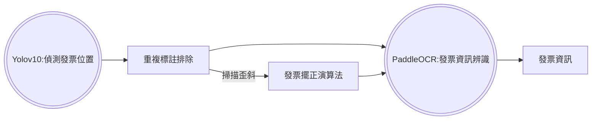

# 交接文件

## 流程圖



---

## PaddleOCR

### Inference Results

<div style="margin:0; padding:0;">
  <div style="width:100%; padding:0; margin:0;">
    
    
    
  </div>
</div>

### PaddleOCR Wrapper (program)

一個簡單易用的 PaddleOCR 包裝器，用於批次處理圖片 OCR 辨識

#### 檔案說明

- `paddle_ocr_wrapper.py`： 核心 OCR 處理模組
- `cli.py`： 命令行介面
- `test_ocr.py`： 使用範例

#### 使用方式

##### 1. 作為 Python 模組使用 (test_ocr.py)

```python
from paddle_ocr_wrapper import PaddleOCRWrapper

# 初始化 OCR
ocr = PaddleOCRWrapper(device="gpu:0")  # 或使用 "cpu"

# 處理圖片
ocr.process_images(
    input_path="/path/to/images",      # 輸入路徑（可以是單一圖片或目錄）
    output_path="/path/to/output",     # 輸出目錄
    file_formats=['.png', '.jpg']      # 可選：指定要處理的檔案格式
)
```

##### 2. 使用命令行介面

```bash
# 基本用法
python cli.py -i /path/to/images -o /path/to/output

# 進階選項
python cli.py \
    -i /path/to/images \           # 輸入路徑
    -o /path/to/output \           # 輸出路徑
    -d cpu \                       # 可選：使用 CPU（預設為 gpu:0）
    -f .png .jpg .jpeg            # 可選：指定檔案格式
```

##### 3. 執行測試範例

```bash
python test_ocr.py
```

#### 輸出結果

程式會為每張圖片創建一個對應的輸出目錄，包含：
- OCR 結果的視覺化圖片
- JSON 格式的文字辨識結果

#### 環境要求

- Python 3.11
- PaddleOCR
- 其他依賴項（建議使用 GPU 加速）

#### 注意事項

1. 預設使用 GPU 進行推理，如果沒有 GPU 或要使用 CPU，請在初始化時指定 `device="cpu"`
2. 支援批次處理整個目錄的圖片
3. 預設支援 .png、.jpg、.jpeg 格式的圖片

---

## Yolov10

### Dataset
訓練資料集：
| 名稱 | 訓練資料數量(train) | 驗證資料數量(val) | 測試資料數量(test) | 總資料數量| 比例 |
| :--------: | :--------: | :--------: | :--------: | :--------: | :--------: |
| 2025年零用金(3~7月) | 270 | 38 | 76 | 384 | 7:1:2 |

Dataset Structure：
```
full_yolov10
├── images/ (main use)
│   ├── train/
│   │   ├── 2025y3m_allowance-001.png
│   │   ├── 2025y3m_allowance-002.png
│   │   └── ...
│   ├── val/
│   │   └── ...
│   └── test/
│       └── ...
│
├── labels/ (structure same as images, .txt)
│   └── ...
│
├── original_images (backup, without rotate, structure same as images)
│   └── ...
│
├── train.txt (train image list)
├── val.txt (val image list)
└── test.txt (test image list)
```

### Model

已訓練模型：
| No. | base model | Epoch | img size | batch | performance |
| :--------: | :--------: | :--------: | :--------: | :--------: | :--------: |
|1| v10m-640-16_1026-1956     |  100    | 640     |  16 |   |
|2| v10m-1280-4_1026-1956     |  100    | 1280     |  4 | v |
|3| v10b-640-16_1102-1805     |  100    | 640     |  16 |   |
|4| v10b-1280-4_1102-1805     |  100    | 1280     |  4 | v |
|5| v10l-640-16_1026-2134     |  100    | 640     |  16 |   |
|6| v10l-1280-4_1026-2134     |  100    | 1280     |  4 | v |

## Future Work

1. 使用高標註品質資料訓練模型：繼續增加模型表現，避免走發票擺正演算法
2. 優化模型方法：提高訓練Epoch、增加Data augmentation的數量、提高image size(原圖尺寸 : 2000x3000up)
3. 增加發票標註的數量：現有資料包含2025年3~7月零用金，可考慮使用labelstudio標註8、9月之發票
4. 重複標註排除：使用IoU評斷重疊情況，分數過高即代表重複標註
5. 整合細項功能